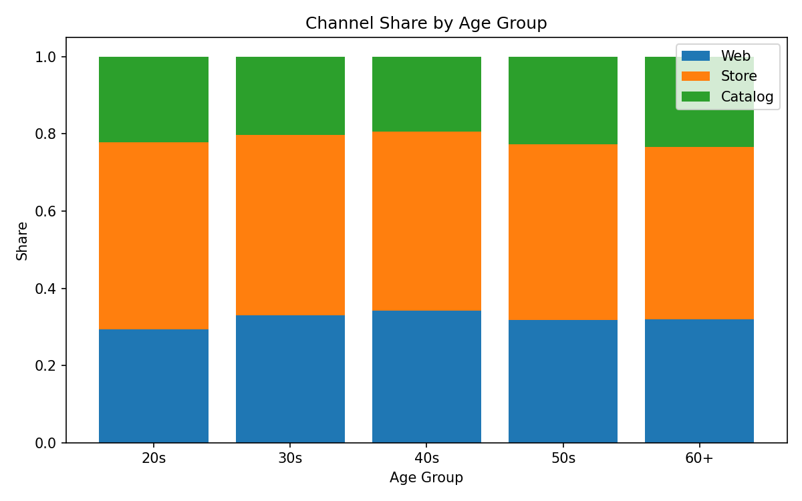
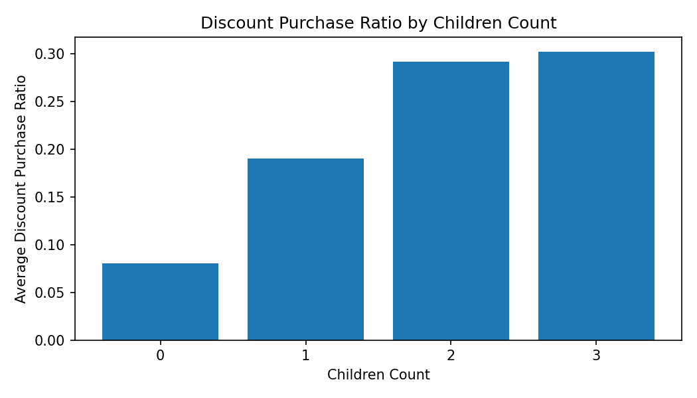
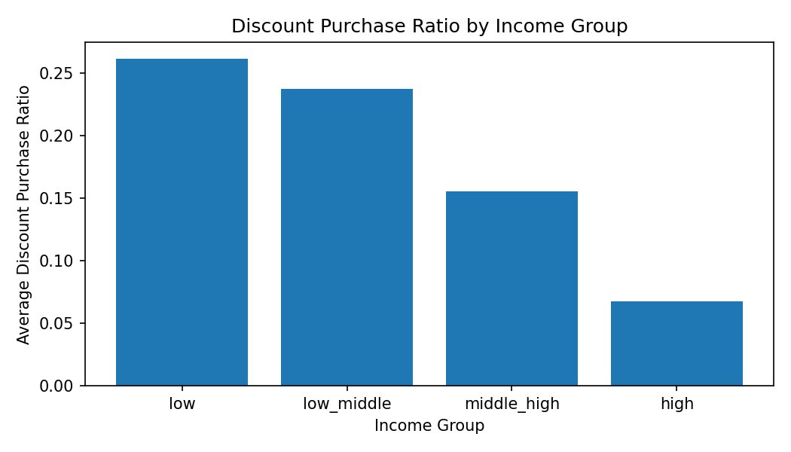
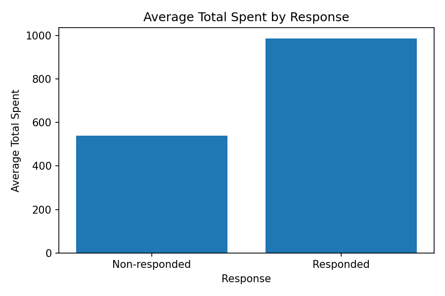
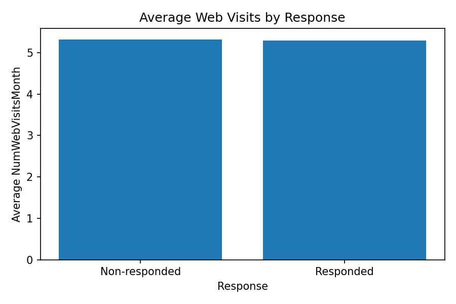
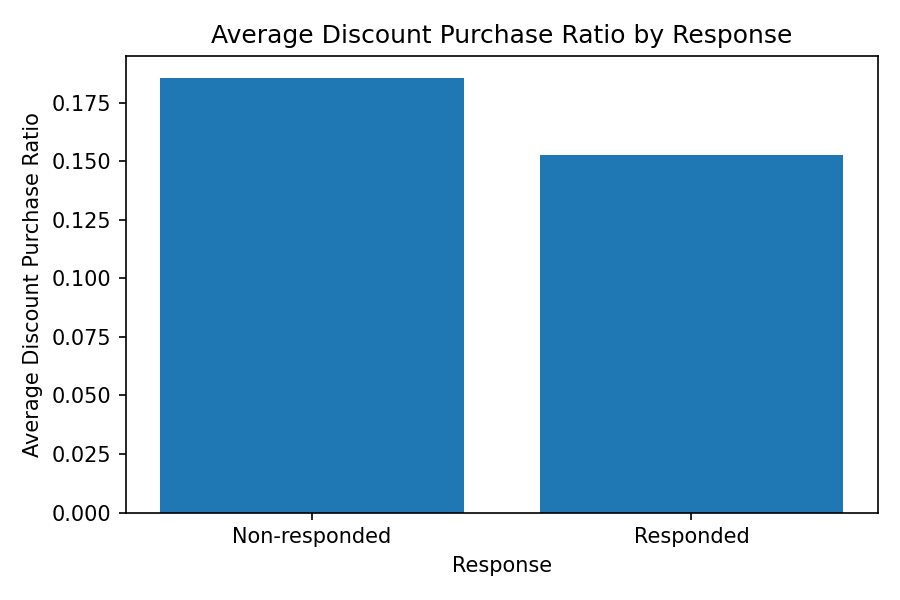

# iFood Customer Segmentation Analysis

iFood 고객 데이터를 활용하여  
**연령, 자녀 수, 소득 수준, 캠페인 응답 여부**에 따른  
**구매 채널 선호 / 할인 민감도 / 고객 특성 차이**를 분석한 프로젝트입니다.

기존 부트캠프 발표자료를 기반으로,  
포트폴리오 제출용으로 분석 구조와 인사이트를 재정리했습니다.

---

## 1. Project Overview

본 프로젝트는 고객 세그먼트에 따라  
어떤 채널을 선호하는지,  
어떤 고객군이 할인 프로모션에 더 민감한지,  
캠페인 응답 고객과 비응답 고객이 어떻게 다른지를 분석하는 것을 목표로 합니다.

분석은 다음 세 질문을 중심으로 진행했습니다.

1. 연령대에 따라 구매 채널 선호가 다른가?  
2. 자녀 수와 소득 수준에 따라 할인 프로모션 민감도가 다른가?  
3. 캠페인 응답 고객과 비응답 고객은 구매/방문/할인 활용 측면에서 어떤 차이를 보이는가?  

---

## 2. Dataset & Feature Definitions

사용 데이터: `data/marketing_campaign.csv`

주요 파생 변수 정의:

- **Age** = `2014 - Year_Birth`
- **Children Count** = `Kidhome + Teenhome`
- **Total Spent** =  
  `MntWines + MntFruits + MntMeatProducts + MntFishProducts + MntSweetProducts + MntGoldProds`
- **Discount Purchase Ratio** =  
  `NumDealsPurchases / (NumWebPurchases + NumCatalogPurchases + NumStorePurchases + NumDealsPurchases)`

캠페인 응답 여부는 데이터의 `Response` 컬럼을 기준으로 비교했습니다.

---

## 3. Analysis Questions

### Q1. Age × Channel Preference
연령대별로 Web / Store / Catalog 구매 비중이 어떻게 다른가?

### Q2. Discount Sensitivity
자녀 수와 소득 수준에 따라 할인 구매 비중이 어떻게 달라지는가?

### Q3. Responders vs Non-responders
캠페인 응답 고객과 비응답 고객은  
총 구매금액, 웹사이트 방문 수, 할인 구매 비중에서 차이가 있는가?

---

## 4. Key Findings

### 4-1. Age × Channel Preference

- 30~40대는 Web 구매 비중이 상대적으로 높게 나타났습니다.
- 20대는 Store 구매 비중이 상대적으로 높게 나타났습니다.
- 50대 이상에서는 Catalog 구매 비중이 상대적으로 높게 나타났습니다.

> 아래 이미지는 이 섹션의 핵심 근거 시각화입니다.



---

### 4-2. Discount Sensitivity

- 자녀 수가 많을수록 할인 프로모션 활용 비중이 증가하는 경향이 나타났습니다.
- 소득 수준이 낮을수록 할인 프로모션 활용 비중이 높게 나타났습니다.

#### Children Count × Discount Ratio


#### Income Group × Discount Ratio


---

### 4-3. Responders vs Non-responders

- 캠페인 응답 고객은 비응답 고객보다 총 구매금액이 높게 나타났습니다.
- 웹사이트 방문 수는 응답 고객과 비응답 고객 간 뚜렷한 차이가 확인되지 않았습니다.
- 비응답 고객은 응답 고객보다 할인 구매 비중이 더 높게 나타났습니다.

#### Total Spent by Response


#### Web Visits by Response


#### Discount Ratio by Response


---

## 5. Suggested Marketing Actions

분석 결과를 바탕으로 다음과 같은 세그먼트별 액션을 제안할 수 있습니다.

| Segment | Observed Pattern | Suggested Action |
|---|---|---|
| 20대 | Store 비중 상대적으로 높음 | 매장 연계형 프로모션 검토 |
| 30~40대 | Web 비중 상대적으로 높음 | 웹/디지털 채널 중심 메시지 강화 |
| 50대 이상 | Catalog 비중 상대적으로 높음 | 카탈로그/직접반응형 채널 검토 |
| 다자녀 가구 | 할인 구매 비중 높음 | 묶음 할인 / 생필품 프로모션 검토 |
| 저소득층 | 할인 구매 비중 높음 | 가격 민감 세그먼트 대상 프로모션 설계 |
| 응답 고객 | 총 구매금액 높음 | 리텐션/업셀 전략 검토 |
| 비응답 고객 | 할인 구매 비중 높음 | 할인 강도/프로모션 메시지 테스트 |

---

## 6. Limitations

- 본 분석은 **관측 데이터 기반의 세그먼트 비교**이며,  
  캠페인 효과의 인과관계를 직접 증명하는 분석은 아닙니다.
- 일부 그룹은 표본 수가 상대적으로 작을 수 있으므로 해석에 주의가 필요합니다.
- 응답 고객과 비응답 고객의 차이는 “캠페인이 구매를 증가시켰다”는 의미가 아니라,  
  **응답 고객군과 비응답 고객군의 특성 차이**로 해석해야 합니다.

---

## 7. Repository Structure

```text
ifood-customer-segmentation-analysis/
│
├── README.md
├── data/
│   └── marketing_campaign.csv
│
├── notebooks/
│   └── 01_ifood_marketing_analysis.ipynb
│
├── reports/
│   ├── tables/
│   └── figures/
│
└── slides/
    └── marketing_analysis.pdf