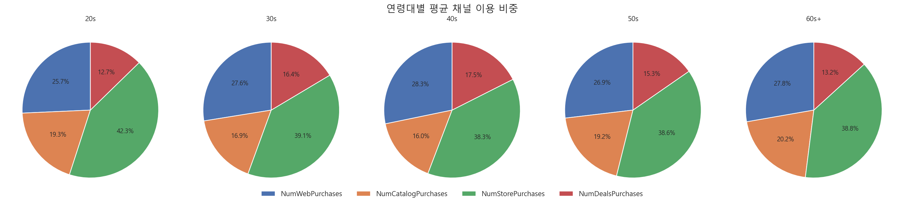
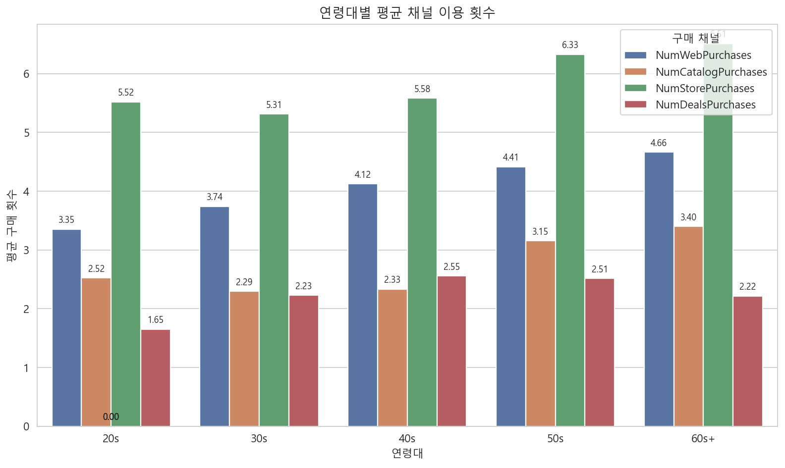
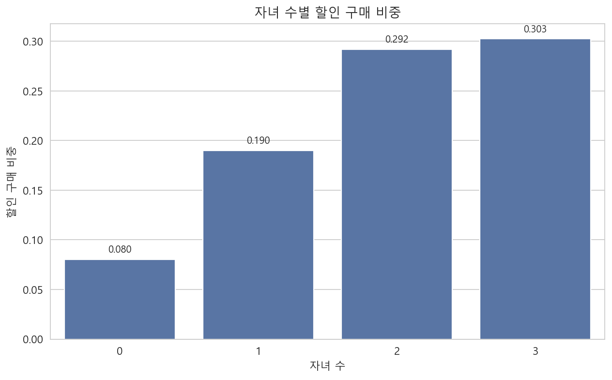
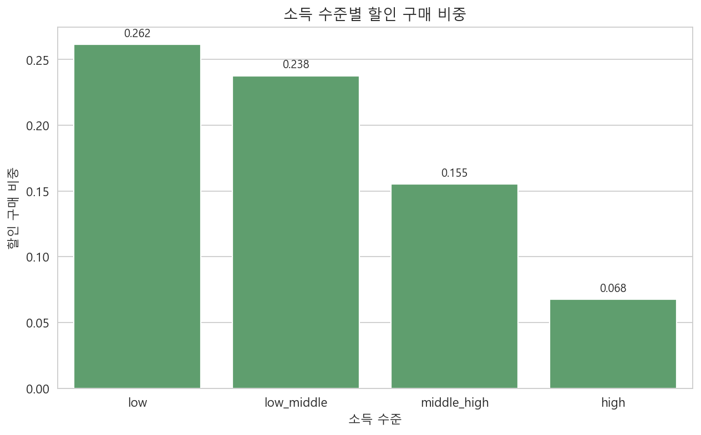
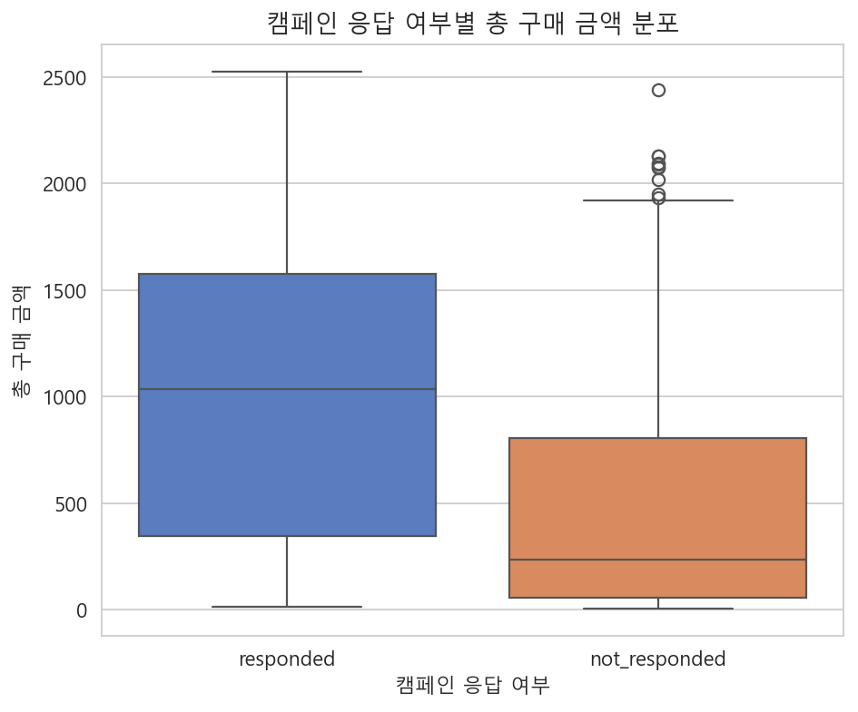
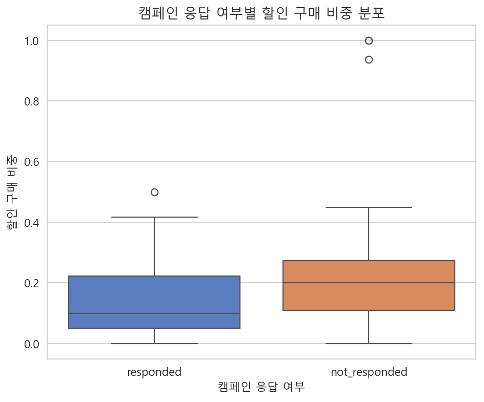
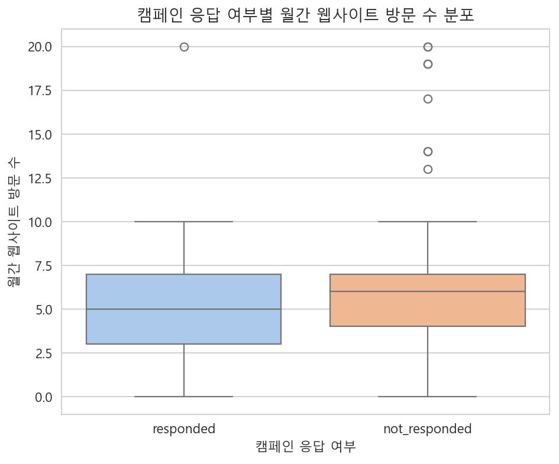

# iFood Customer Segmentation Analysis

iFood 고객 데이터를 활용하여 **연령대별 채널 이용 특성**, **자녀 수/소득 수준에 따른 할인 민감도**, **캠페인 응답 고객과 비응답 고객의 차이**를 분석한 프로젝트입니다.

> 이 README의 시각화는 **기존 발표 슬라이드의 차트 구조를 유지**하도록 정리했습니다.  
> 즉, 연령대 채널 분석은 **비중(원형 차트) + 횟수(묶은 막대차트)**,  
> 할인 민감도는 **막대그래프**,  
> 캠페인 응답 분석은 **분포 비교용 박스플롯**으로 구성했습니다.

---

## 1. Project Goal

이 프로젝트는 다음 세 가지 질문에 답하기 위해 진행했습니다.

1. 연령대에 따라 구매 채널 이용 패턴이 다른가?  
2. 자녀 수와 소득 수준에 따라 할인 프로모션 활용도가 다른가?  
3. 캠페인 응답 고객과 비응답 고객은 구매 금액, 웹사이트 방문, 할인 구매 측면에서 어떤 차이를 보이는가?  

---

## 2. Dataset & Feature Definitions

- 데이터: `data/marketing_campaign.csv`
- 주요 파생 변수
  - `Age = 2014 - Year_Birth`
  - `AgeGroup = 20s / 30s / 40s / 50s / 60s+`
  - `TotalChildren = Kidhome + Teenhome`
  - `IncomeGroup = Income 4분위 그룹`
  - `TotalSpend = MntWines + MntFruits + MntMeatProducts + MntFishProducts + MntSweetProducts + MntGoldProds`
  - `DiscountRatio = NumDealsPurchases / (NumWebPurchases + NumCatalogPurchases + NumStorePurchases + NumDealsPurchases)`
  - `CampaignResponse = AcceptedCmp1~5 및 Response 중 하나라도 수락 시 responded, 아니면 not_responded`

---

## 3. Analysis 1 — Age × Channel Usage

### 핵심 인사이트
- 30대 및 40대에서 웹(온라인) 구매 비중이 높게 나타났습니다.
- 20대는 매장 구매 비중이 상대적으로 높게 나타났습니다.
- 50대 이상에서는 카탈로그 이용 비중이 상대적으로 높게 나타났습니다.
- 전체적으로 채널 이용 횟수는 연령대가 높아질수록 증가하는 경향을 보였습니다.
- 할인 구매 횟수는 중년층에서 높고, 고연령대에서 낮아지는 패턴을 보였습니다.

### 근거 시각화 1 — 연령대별 평균 채널 이용 비중


### 근거 시각화 2 — 연령대별 평균 채널 이용 횟수


> **이미지 배치 규칙**  
> 위 섹션에서는 반드시 **비중 차트(원형 차트)를 먼저**, **이용 횟수 차트(묶은 막대그래프)를 다음에** 넣습니다.  
> 이유는 “비중”을 먼저 읽고, 그 다음 “실제 평균 횟수”로 보강하는 흐름이 발표 슬라이드와 가장 유사하기 때문입니다.

---

## 4. Analysis 2 — Discount Sensitivity

### 핵심 인사이트
- 자녀 수가 많을수록 할인 프로모션 이용 비중이 높게 나타났습니다.
- 소득 수준이 증가할수록 할인 구매 비중은 감소하는 패턴을 보였습니다.

### 근거 시각화 1 — 자녀 수별 할인 구매 비중


### 근거 시각화 2 — 소득 수준별 할인 구매 비중


> **이미지 배치 규칙**  
> 이 섹션은 두 그래프를 **세로로 이어서** 배치합니다.  
> 자녀 수 그래프를 먼저 넣고, 아래에 소득 수준 그래프를 배치합니다.  
> 같은 “할인 민감도” 섹션 안에서 **가구 구조 → 경제 수준** 순으로 읽히게 하는 것이 자연스럽습니다.

---

## 5. Analysis 3 — Responded vs Not Responded

### 핵심 인사이트
- 총 구매 금액은 캠페인에 응답한 고객이 비응답 고객보다 높게 분포되어 있습니다.
- 응답 고객과 비응답 고객의 웹사이트 방문 수 차이는 크지 않습니다.
- 비응답 고객의 할인 구매 비중이 응답 고객보다 더 높게 나타났습니다.

### 근거 시각화 1 — 캠페인 응답 여부별 총 구매 금액 분포


### 근거 시각화 2 — 캠페인 응답 여부별 할인 구매 비중 분포


### 근거 시각화 3 — 캠페인 응답 여부별 월간 웹사이트 방문 수 분포


> **이미지 배치 규칙**  
> 이 섹션은 반드시  
> **(1) 총 구매 금액 → (2) 할인 구매 비중 → (3) 웹사이트 방문 수**  
> 순서로 배치합니다.  
> 이유는 “구매가치 차이 → 할인 의존도 차이 → 방문수 차이 없음”의 스토리 흐름이 가장 자연스럽기 때문입니다.

---

## 6. Strategic Suggestions

- 연령대별 채널 선호 차이가 보이므로 연령대별 최적화된 프로모션 설계가 필요합니다.
- 다자녀 가정과 저소득층 고객은 가격 민감도 및 할인 의존도가 높으므로, 할인 전략을 보다 정교하게 설계할 필요가 있습니다.
- 비응답 고객은 할인 의존도가 높은 반면, 응답 고객은 구매 금액이 높으므로 동일한 프로모션 전략보다 세그먼트별 액션이 적절합니다.

---

## 7. Repository Structure

```text
ifood-customer-segmentation-analysis/
│
├── README.md
├── data/
│   └── marketing_campaign.csv
│
├── notebooks/
│   └── ifood_marketing_analysis.ipynb
│
├── reports/
│   ├── tables/
│   │   ├── age_channel_mean.csv
│   │   ├── age_channel_share.csv
│   │   ├── children_discount_ratio.csv
│   │   ├── income_discount_ratio.csv
│   │   └── response_summary.csv
│   └── figures/
│       ├── 01_age_channel_share_pies.png
│       ├── 02_age_channel_avg_counts.png
│       ├── 03_children_discount_ratio_bar.png
│       ├── 04_income_discount_ratio_bar.png
│       ├── 05_response_total_spend_box.png
│       ├── 06_response_discount_ratio_box.png
│       └── 07_response_web_visits_box.png
│
└── slides/
    └── marketing_analysis.pdf
```

---

## 8. Reproducibility

1. `data/marketing_campaign.csv`를 저장합니다.  
2. `notebooks/ifood_marketing_analysis.ipynb`를 실행합니다.  
3. 결과 표는 `reports/tables/`, 시각화 이미지는 `reports/figures/`에 저장됩니다.  
4. README는 저장된 이미지 파일을 직접 참조합니다.  

---
